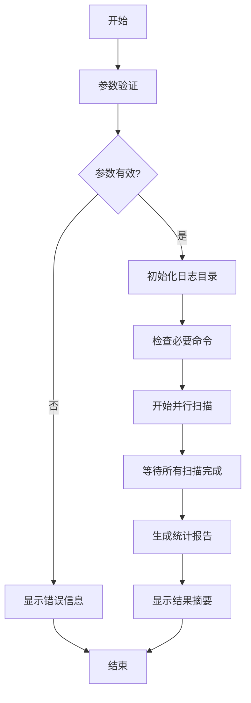

# 🌐 Ping 网络IP占用检测工具

> 这是一个功能强大的网络扫描工具，可以快速检测指定网段内的在线设备，并检查常用服务（SSH和RDP）的可用性。该工具使用Bash脚本编写，支持并行扫描以提高效率。

## ✨ 主要功能

- 🔍 扫描指定网段内的所有IP地址
- 🚀 支持并行扫描，大幅提高扫描速度
- 🔔 检测设备在线状态
- 🔒 检查SSH（22端口）和RDP（3389端口）服务状态
- 📊 生成详细的扫描报告
- 🎨 彩色输出，直观显示扫描结果

## 📋 使用方法

### 基本用法

```bash
./ping.sh <网络地址> [起始IP] [结束IP]
```

### 参数说明

| 参数 | 说明 | 是否必须 | 默认值 |
|------|------|----------|--------|
| 网络地址 | 要扫描的网段，如192.168.1.0 | ✅ 必须 | - |
| 起始IP | 扫描范围的起始IP末位 | ❌ 可选 | 2 |
| 结束IP | 扫描范围的结束IP末位 | ❌ 可选 | 253 |

### 示例

```bash
# 扫描192.168.1.0/24网段的所有IP（从2到253）
./ping.sh 192.168.1.0

# 扫描192.168.1.0/24网段的特定范围（从10到50）
./ping.sh 192.168.1.0 10 50

# 扫描10.0.0.0/24网段的所有IP
./ping.sh 10.0.0.0
```

## 🔧 函数说明

| 函数名 | 说明 |
|--------|------|
| `echo_color()` | 彩色输出文本，支持多种颜色（红、绿、黄、蓝、紫） |
| `validate_ip()` | 验证IP地址格式是否正确 |
| `check_commands()` | 检查必要命令是否存在 |
| `validate_parameters()` | 验证输入参数的有效性 |
| `init_log_dir()` | 初始化日志目录 |
| `scan_ip()` | 扫描单个IP地址并检查服务状态 |
| `run_scan()` | 执行整个扫描过程，包括并行控制 |
| `generate_report()` | 生成扫描统计报告 |
| `main()` | 主函数，协调整个扫描流程 |

## 📂 输出文件

| 文件 | 说明 |
|------|------|
| `pinglog/scan_result_YYYYMMDD_HHMMSS.txt` | 包含所有扫描结果的详细日志文件 |

## 📥 从GitHub下载

您可以通过以下方式从GitHub获取此工具：

### 方法1：使用curl下载单个脚本

```bash
curl -O https://github.com/wangb335/ping/blob/main/ping.sh
chmod +x ping.sh
```

## 🌐 在线使用

### 2. 使用在线终端服务

>在支持bash的在线终端中运行,带参数执行示例（扫描192.168.1.0网段，线程数2，超时10秒）

```bash
curl -s https://raw.githubusercontent.com/wangb335/ping/main/ping.sh | bash -s -- 192.168.1.0 2 10
```

```bash
bash <(curl -s https://raw.githubusercontent.com/wangb335/ping/main/ping.sh) 192.168.1.0 2 10
```

参数说明：

1. 第一个参数：要扫描的IP网段（如192.168.1.0）
2. 第二个参数：并发线程数（默认2）
3. 第三个参数：超时时间（秒，默认10）

## 📊 工作流程



## ⚠️ 注意事项

- **需要root权限**：某些系统可能需要root权限才能执行ping命令
- **依赖项**：需要安装`ping`和`nc`(netcat)命令
- **网络负载**：大范围并行扫描可能会增加网络负载
- **扫描权限**：在扫描前请确保您有权限扫描目标网络
